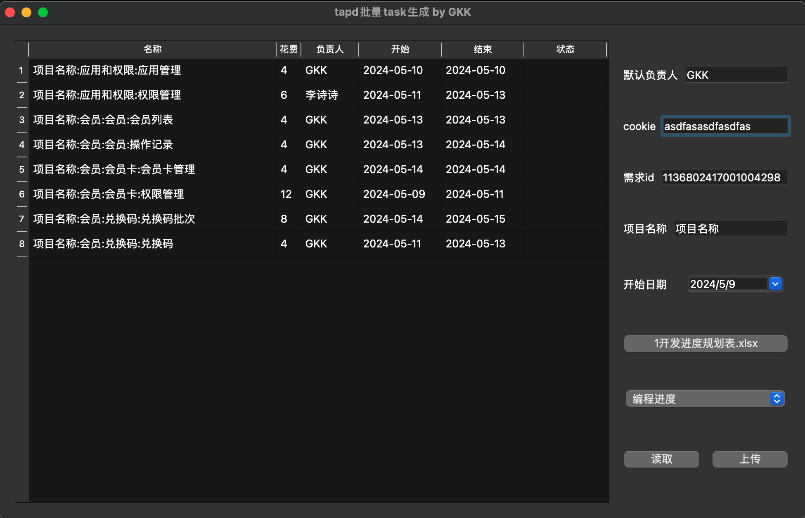
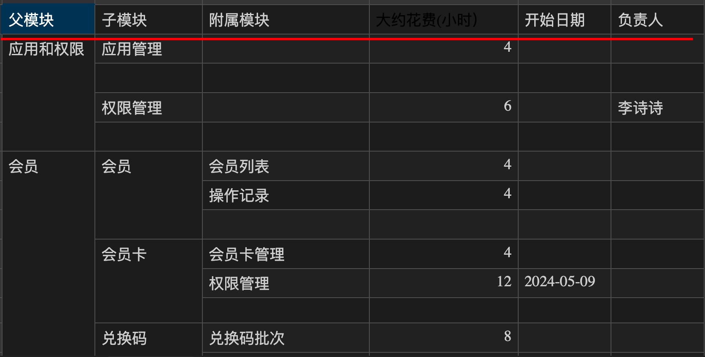

用到了，点个赞再走

 

原始文档，“花费”的前的几列会拼接作为人物名称，开始日期不指定按照项目开始时间顺延，假期上班和工作日休息判断需要配置json
 

## 安装
pip install pyside6,openpyxl,dateparser,requests  

## 使用
- 获取自己的cookie，和操作的storyid，网页tapd使用F12查看
- 将获取的参数添加到conf.json中
- python task.py
- 选择文件打开
- 选择sheet读取
- 上传即可批量新建任务
- 再次读取sheet，可刷新任务id
- 选中任务id，右击可批量完成任务